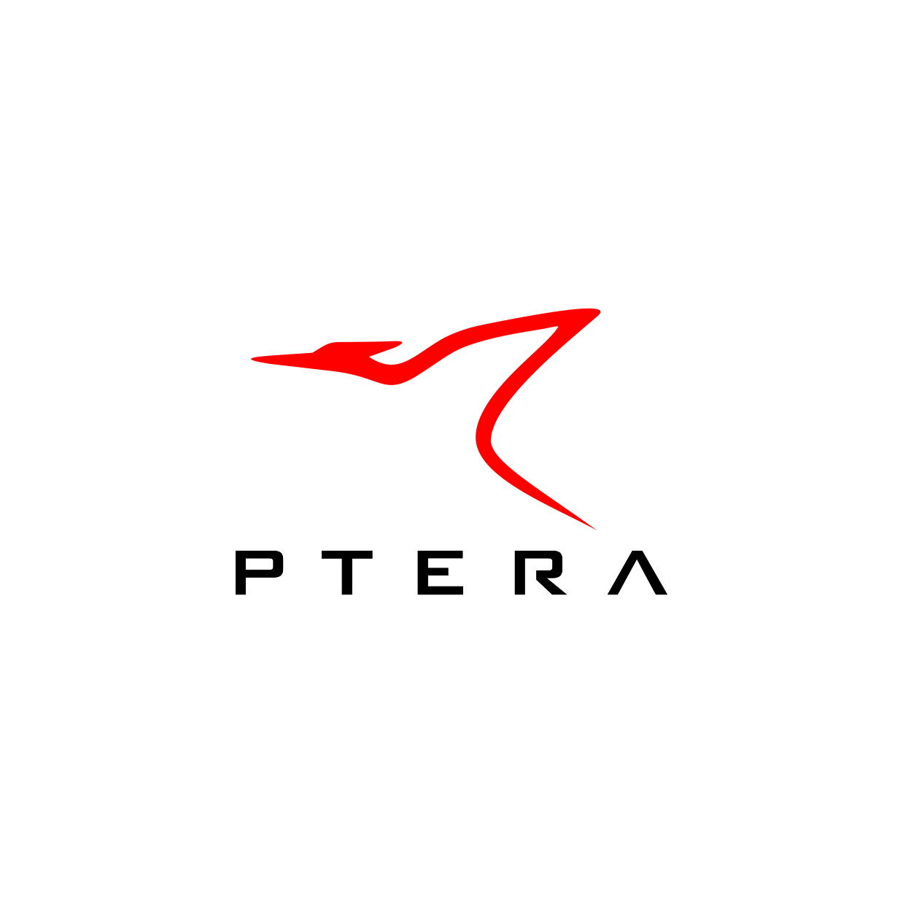
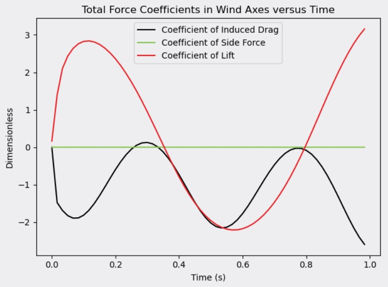
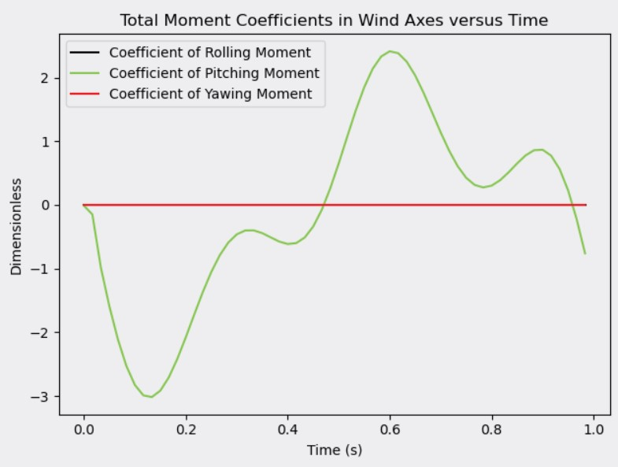

# Ptera Software



The minimum viable release of the Ptera Software suite: a fast, easy-to-use, and open source software package for analyzing flapping-wing flight.

## Motivation

This project's primary deliverable is an open source, fast, unsteady aerodynamics solver for analyzing flapping-wing flight

## Build Status


## Code Style


## Example Output

### Steady Horseshoe VLM

### Steady Ring VLM

### Unsteady Ring VLM

### Prescribed Wake






### Free Wake

## Features


## Code Example

### Script

```
import pterasoftware as ps

example_airplane = ps.geometry.Airplane(
    wings=[
        ps.geometry.Wing(
            symmetric=True,
            wing_cross_sections=[
                ps.geometry.WingCrossSection(
                    airfoil=ps.geometry.Airfoil(name="naca2412",),
                ),
                ps.geometry.WingCrossSection(
                    y_le=5.0, airfoil=ps.geometry.Airfoil(name="naca2412",),
                ),
            ],
        ),
    ],
)

example_operating_point = ps.operating_point.OperatingPoint()

example_problem = ps.problems.SteadyProblem(
    airplane=example_airplane, operating_point=example_operating_point,
)

example_solver = ps.steady_horseshoe_vortex_lattice_method.SteadyHorseshoeVortexLatticeMethodSolver(
    steady_problem=example_problem
)

example_solver.run()

ps.output.draw(
    solver=example_solver, show_delta_pressures=True, show_streamlines=True,
)
```

### Output

## Installation

```pip install pterasoftware```

### Requirements

matplotlib >= 3.2.2, < 4.0.0

numpy >= 1.18.5, < 1.19.0

pyvista >= 0.25.3, < 1.0.0

scipy >= 1.5, < 2.0

codecov >= 2.1.8, < 3.0.0

numexpr >= 2.7.1, < 3.0.0

pre-commit >= 2.6, < 3.0

black >= 19.10b0, < 20.0

## Tests


## How to Use

## Contribute

## Credits

## License


