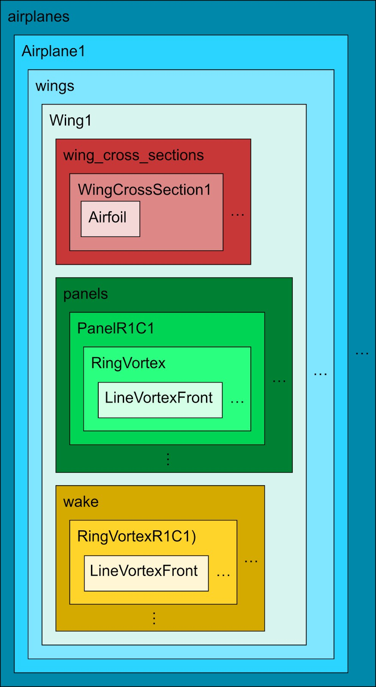

# Axes, Points, and Frames in Ptera Software

Ptera Software simulates flapping-wing dynamics and aerodynamics using several different axis systems, reference points, and reference frames. The notation and terminology I use is an extended version of that introduced in "Flight Vehicle Aerodynamics" by Mark Drela.

## Axis Systems vs. Reference Points vs. Reference Frames

An axis system, also called “axes,” contains information about three directions. An axis system can be cartesian (three linear directions), polar (two linear directions and one angular direction), or spherical (one linear direction and two angular directions).

Reference points, also called “points,” contain information about the location of a particular point in space.

Lastly, a reference frame, also called a “frame,” contains information about the location of an “observer,” and their motion relative to what is observed.

Consider the arbitrary vector **r**, which exists in 3D space. For now, let’s say that **r** is a force vector. In order to express **r** using components, we must, at a minimum, pick an axis system. If instead **r** is a position vector, we need both axes and a reference point to serve as an origin, so we must pick both before writing down **r**’s three components. The same is true if **r** is a moment, but now the reference point no longer serves as an origin, but instead the point about which the moment acts. Lastly, if **r** is some time derivative of position, such as a velocity or acceleration vector, then we no longer need a reference point, but we do require both an axis system and a reference frame.

Due to the nested structure of Ptera Software’s geometry objects, in practice, many vector-valued quantities like positions and moments, use reference points and axes that are defined locally within a given object. An example of this next structure for an unsteady vortex lattice method simulation is shown below.

# Specifying Axes, Points, and Frames

Given the varied requirements for vector-valued quantities, it is important that we are very specific when assigning them variable names or referencing them in text. Also, due to the hierarchical structure of Ptera Software’s objects, additional specificity may be required depending on the context. For example, if we use a force vector within the Wing class that references wing axes, we still need to specify that this vector is given in wind axes, but we don’t (and can’t) specify which of the parent Airplane object’s Wing object’s wing axes we mean. In contrast, if we declare a variable inside the Wing class that references wing cross section axes, we must specify which of the Wing object’s WingCrossSection objects the axes refer to.

## Patterns

There are three useful combinations of axes, points, and frames. For variables that fall into each of these three cases, we denote them by appending information to their variable names using **IDs**. When referencing the variables in comments and docstrings, we add this additional information parenthetically using **names**:

1. Axes without a point and without a frame  
   \[variable name\]\_\[axes ID\]  
   “\[variable name\] (in \[axes name\])”
2. Axes without a point and with a frame  
   \[variable name\]\_\[axes ID\]\_\_\[frame ID\]  
   “\[variable name\] (in \[axes name\], observed from the \[frame name\])”  
3. Axes with a point and without a frame  
   \[variable name\]\_\[axes ID\]\_\[point ID\]  
   “\[variable name\] (in \[axes name\], relative to the \[point name\])”

The correct name and ID for a particular axis system, point, or frame depends on the level of context. However, in all cases IDs consist of a series of abbreviations, moving in scope from most specific to least specific. By contrast, names move from least specific to most specific. Also, in contrast with IDs, the exact syntax for names is slightly flexible to allow for the description to sound correct in plain English.

The standard abbreviations and names are given below for reference. See the section for a particular axis system, point, or frame for examples of the correct IDs and names in various contexts.

## ID Abbreviations and Names

* E: Earth  
* B: body  
* P: airplane  
* W: wind  
* G: geometry  
* Wn: wing  
* Wcs: wing cross section  
* Wcsp: wing cross section’s parent  
* A: airfoil  
* I: Simulation’s starting point  
* Cgi: starting point  
* Cg: CG point  
* Ler: leading edge’s root point  
* Lp: leading point  
* Lpp: leading point’s parent  
* …pp…: panel point  
  * Fr…: front right  
  * Fl…: front left  
  * Bl…: back left  
  * Br…: back right  
  * C…: collocation  
  * …r\[m\]c\[n\]: (m, n)  
* …bhvp…: bound horseshoe vortex’s point  
  * Fr…: front right  
  * Fl…: front left  
  * Bl…: back left  
  * Br…: back right  
  * …r\[m\]c\[n\]: (m, n)  
* …brvp…: bound ring vortex point  
  * Fr…: front right  
  * Fl…: front left  
  * Bl…: back left  
  * Br…: back right  
  * …r\[m\]c\[n\]: (m, n)  
* …wrvp…: wake ring vortex point  
  * Fr…: front right  
  * Fl…: front left  
  * Bl…: back left  
  * Br…: back right  
  * …r\[m\]c\[n\]: (m, n)  
* …whvp…: wake horseshoe vortex point  
  * Fr…: front right  
  * Fl…: front left  
  * Bl…: back left  
  * Br…: back right  
  * …\[n\]: n  
* …lvp…: line vortex’s point  
  * S…: start  
  * E…: end  
  * C…: center  
  * …f: front leg  
  * …l: left leg  
  * …b: back leg  
  * …r: right leg

# Axis Systems

## 1. The Earth axis system

* Basis directions  
  1. North  
  2. East  
  3. Down  
* Right-handed  
* References  
  * Text: …in Earth axes…  
  * Variables: …\_E…

## 2. Body axes

* Basis directions  
  1. Towards the front of the airplane  
  2. Towards the right of the airplane  
  3. Towards the bottom of the airplane  
* Right-handed  
* Local reference examples  
  * Text: …in body axes…  
  * Variables: …\_B…  
* Non-local reference examples  
  * Text: …in the first airplane’s body axes…  
  * Variables: …\_BP1…

## 3. Wind axes

* Caveat: We assume a still airmass in Ptera Software, so the freestream velocity observed from the body frame is solely due to the airplane’s velocity observed from the Earth frame.  
* Basis directions  
  1. In line with (parallel, not anti-parallel, to) the freestream velocity vector observed from the body frame  
  2. In the direction perpendicular to first and third components\*  
  3. In the direction perpendicular to first and second components\*  
* \*There are infinite options for the second and third components that satisfy the perpendicularity requirement. Therefore, we define them using a thought experiment: Imagine three unit vectors pointing along the geometry axes' basis directions, as defined in Earth axes. There is exactly one pair of angles, which we'll call α and β, that we can use to perform a 2-3 series of **extrinsic** rotations to exactly align the geometry and wind axes’ first basis vectors. After these rotations, the body axes' second and third basis vectors point in wind axes’ second and third basis directions.  
      The two angles α and β are commonly known as the angle of attack and the angle of sideslip. Wind axes are commonly defined using these angles. This is because they are intuitively understood by many aerodynamicists: in the simplest scenarios, a positive α generally corresponds to the airplane’s nose pointing above its direction of travel, and a positive β to it pointing to the left of its direction of travel. However, this can be a bit cyclical, and obscures some subtlety in their definition: defining α and β based on the convention described previously, allows us to define lift as the aerodynamic force’s component in the wind axes’ third basis direction, thereby making lift independent of sideslip.  
* Right-handed  
* Local reference examples  
  * Text: …in wind axes…  
  * Variables: …\_W…  
* Non-local reference examples  
  * Text: …in the first airplane’s wind axes…  
  * Variables: …\_WP1…

## 4. Geometry axes

* Basis directions  
  1. Towards the back of the airplane  
  2. Towards the right of the airplane  
  3. Towards the top of airplane  
* Right-handed  
* Local reference examples  
  * Text: …in geometry axes…  
  * Variables: …\_G…  
* Non-local reference examples  
  * Text: …in the first airplane’s geometry axes…  
  * Variables: …\_GP1…

## 5. Wing axes

* Basis directions  
  1. Towards the back of the wing in its first wing cross section's plane  
  2. Normal to the wing’s first wing cross section’s plane in the general direction of the next wing cross section  
  3. Towards the top surface of the wing  
* Right-handed for non-symmetric and symmetric-continuous wings. Left-handed for mirror-only wings.  
* Local reference examples  
  * Text: …in wing axes…  
  * Variables: …\_Wn…  
* Airplane-local reference examples  
  * Text: …in the first wing’s axes…  
  * Variables: …\_Wn1…  
* Non-local reference examples  
  * Text: …in the first airplane’s second wing’s axes…  
  * Variables: …\_Wn2P1…

## 6. Wing cross section axes

* Basis directions  
  1. Towards the trailing edge in the wing cross section's plane  
  2. Normal to the wing cross section's plane in the general direction of the next wing cross section  
  3. Towards the top surface of the wing  
* Right-handed for wing cross sections of non-symmetric and symmetric-continuous wings. Left-handed for wing cross sections of mirror-only wings.  
* Local reference examples  
  * Text: …in wing cross section axes…  
  * Variables: …\_Wcs…  
* Wing-local reference examples  
  * Text: …in the first wing cross section’s axes…  
  * Variables: …\_Wcs1…  
* Airplane-local reference examples  
  * Text: …in the second wing’s third wing cross section’s axes…  
  * Variables: …\_Wcs3Wn2…  
* Non-local reference examples  
  * Text: …in the first airplane’s second wing’s first wing cross section’s axes…  
  * Variables: …\_Wcs1Wn2P1…

## 7. Wing cross section parent axes

* Basis directions identical to wing axes for a wing’s first wing cross section, and identical to the previous wing cross section axes for subsequent ones.  
* Right-handed for wing cross sections of non-symmetric and symmetric-continuous wings. Left-handed for wing cross sections of mirror-only wings.  
* Local reference examples  
  * Text: …in the wing cross section’s parent axes…  
  * Variables: …\_Wcsp…  
* Wing-local reference examples  
  * Text: …in the second wing cross section’s parent axes…  
  * Variables: …\_Wcsp1…  
* Airplane-local reference examples  
  * Text: …in the second wing’s third wing cross section’s parent axes…  
  * Variables: …\_Wcsp3Wn2…  
* Non-local reference examples  
  * Text: …in the first airplane second wing’s first wing cross section’s parent axes…  
  * Variables: …\_Wcsp1Wn2P1…

## 8. Airfoil axes

* Basis directions  
  1. Chordwise towards the airfoil’s trailing point  
  2. Normal to the chord towards the airfoil’s upper line  
* Two-dimensional  
* Local reference examples  
  * Text: …in airfoil axes…  
  * Variables: …\_A…  
* Wing-local reference examples  
  * Text: …in the second wing cross section’s airfoil’s axes…  
  * Variables: …\_AWcs2…  
* Airplane-local reference examples  
  * Text: …in the second wing’s third wing cross section’s airfoil’s axes…  
  * Variables: …\_AWcs3Wn2…  
* Non-local reference examples  
  * Text: …in the first airplane’s second wing’s first wing cross section’s airfoil’s axes…  
  * Variables: …\_AWcs1Wn2P1…

# Reference Points

## 1. Simulation’s starting point

* Position of the first airplane's CG at the start of the simulation  
* Local reference examples  
  * Text: …relative to the simulation’s starting point…  
  * Variables: …\_I

## 2. Starting point

* Position of the airplane's CG at the start of the simulation  
* Local reference examples  
  * Text: …relative to the starting point…  
  * Variables: …\_Cgi  
* Non-local reference examples  
  * Text: …relative to the first airplane’s starting point…  
  * Variables: …\_CgiP1

## 3. CG point

* Position of the airplane's CG  
* Local reference examples  
  * Text: …relative to the CG point…  
  * Variables: …\_Cg  
* Non-local reference examples  
  * Text: …relative to the second airplane’s CG point…  
  * Variables: …\_CgP2

## 4. Leading edge’s root point

* Root point of the wing’s leading edge  
* Local reference examples  
  * Text: …relative to the leading edge’s root point…  
  * Variables: …\_Ler  
* Airplane-local reference examples  
  * Text: …relative to the first wing’s leading edge’s root point…  
  * Variables: …\_Ler1  
* Non-local reference examples  
  * Text: …relative to the first airplane’s second wing’s leading edge’s root point…  
  * Variables: …\_Ler2P1

## 5. Leading point

* The leading point of the wing cross section  
* Local reference examples  
  * Text: …relative to the leading point…  
  * Variables: …\_Lp  
* Wing-local reference examples  
  * Text: …relative to the first wing cross section’s leading point…  
  * Variables: …\_Lp1  
* Airplane-local reference examples  
  * Text: …relative to the second wing’s first wing cross section’s leading point…  
  * Variables: …\_Lp1Wn2  
* Non-local reference examples  
  * Text: …relative to the first airplane’s second wing’s first wing cross section’s leading point…  
  * Variables: …\_Lp1Wn2P1

## 6. Leading point’s parent

* For a wing’s first wing cross section, this is the wing’s leading edge root point. For subsequent wing cross sections, this is the previous wing cross section’s leading point.  
* Local reference examples  
  * Text: …relative to the leading point’s parent)  
  * Variables: …\_Lpp  
* Wing-local reference examples  
  * Text: …relative to the first wing cross section’s leading point’s parent)  
  * Variables: …\_Lpp1  
* Airplane-local reference examples  
  * Text: …relative to the second wing’s first wing cross section’s leading point’s parent)  
  * Variables: …\_Lpp1Wn2  
* Non-local reference examples  
  * Text: …relative to the first airplane’s second wing’s first wing cross section’s leading parent point…  
  * Variables: …\_Lpp1Wn2P1

## 7. Panel’s points

* The front right, front left, back left, back right, and collocation points of the panel  
* Local reference examples  
  * Text: …relative to the panel’s front right point…  
  * Variables: …\_Frpp  
* Wing-local reference examples  
  * Text: …relative to the (3, 2\) panel’s front right point…  
  * Variables: …\_Frppr3c2  
* Airplane-local reference examples  
  * Text: …relative to the second wing’s (3, 2\) panel’s front right point…  
  * Variables: …\_Frppr3c2Wn2  
* Non-local reference examples  
  * Text: …relative to the first airplane’s second wing’s (3, 2\) panel’s front right point…  
  * Variables: …\_Frppr3c2Wn2P1

## 8. Bound horseshoe vortex’s points

* Only relevant in steady horseshoe vortex lattice method simulations  
* The front right, front left, back left, and back right points of a bound horseshoe vortex  
* Local reference examples  
  * Text: …relative to the bound horseshoe vortex’s front right point…  
  * Variables: …\_Frbhvp  
* Wing-local reference examples  
  * Text: …relative to the (3, 2\) panel’s bound horseshoe vortex’s front right point…  
  * Variables: …\_Frbhvpr3c2  
* Airplane-local reference examples  
  * Text: …relative to the second wing’s (3, 2\) panel’s bound horseshoe vortex’s front right point…  
  * Variables: …\_Frbhvpr3c2Wn2  
* Non-local reference examples  
  * Text: …relative to the first airplane’s second wing’s (3, 2\) panel’s bound horseshoe vortex’s front right point…  
  * Variables: …\_Frbhvpr3c2Wn2P1

## 9. Bound ring vortex’s points

* The front right, front left, back left, and back right points of a bound ring vortex  
* Local reference examples  
  * Text: …relative to the bound ring vortex’s front right point…  
  * Variables: …\_Frbrvp  
* Wing-local reference examples  
  * Text: …relative to the (3, 2\) panel’s bound ring vortex’s front right point…  
  * Variables: …\_Frbrvpr3c2  
* Airplane-local reference examples  
  * Text: …relative to the second wing’s (3, 2\) panel’s bound ring vortex’s front right point…  
  * Variables: …\_Frbrvpr3c2Wn2  
* Non-local reference examples  
  * Text: …relative to the first airplane’s second wing’s (3, 2\) panel’s bound ring vortex’s front right point…  
  * Variables: …\_Frbrvpr3c2Wn2P1

## 10. Wake horseshoe vortex’s points

* Only relevant in steady horseshoe and steady ring vortex lattice method simulations  
* The front right, front left, back left, and back right points of a wake horseshoe vortex  
* Local reference examples  
  * Text: …relative to the wake horseshoe vortex’s front right point…  
  * Variables: …\_Frwhvp  
* Wing-local reference examples  
  * Text: …relative to the third wake horseshoe vortex’s front right point…  
  * Variables: …\_Frwhvp3  
* Airplane-local reference examples  
  * Text: …relative to the second wing’s third wake horseshoe vortex’s front right point…  
  * Variables: …\_Frwhvp3Wn2  
* Non-local reference examples  
  * Text: …relative to the first airplane’s second wing’s third wake horseshoe vortex’s front right point…  
  * Variables: …\_Frwhvp3Wn2P1

## 11. Wake ring vortex’s points

* Only relevant in unsteady ring vortex lattice method simulations  
* The front right, front left, back left, and back right points of a wake ring vortex  
* Local reference examples  
  * Text: …relative to the wake ring vortex’s front right point…  
  * Variables: …\_Frwrvp  
* Wing-local reference examples  
  * Text: …relative to the (3, 2\) wake ring vortex’s front right point…  
  * Variables: …\_Frwrvpr3c2  
* Airplane-local reference examples  
  * Text: …relative to the second wing’s (3, 2\) wake ring vortex’s front right point…  
  * Variables: …\_Frwrvpr3c2Wn2  
* Non-local reference examples  
  * Text: …relative to the first airplane’s second wing’s (3, 2\) wake ring vortex’s front right point…  
  * Variables: …\_Frwrvpr3c2Wn2P1

## 12. Line vortex’s points

* The start, end, and center points of a line vortex  
* Local reference examples  
  * Text: …relative to the line vortex’s start point…  
  * Variables: …\_Slvp  
* Parent-vortex-local reference examples  
  * Text: …relative to the bound horseshoe vortex’s front line vortex’s center point…  
  * Variables: …\_Clvpf  
* Wing-local reference examples  
  * Text: …relative to the (3, 2\) bound horseshoe vortex’s front line vortex’s center point…  
  * Variables: …\_ClvpfBhvr3c2  
* Airplane-local reference examples  
  * Text: …relative to the second wing’s (3, 2\) bound horseshoe vortex’s front line vortex’s center point…  
  * Variables: …\_ClvpfBhvr3c2Wn2  
* Non-local reference examples  
  * Text: …relative to the first airplane’s second wing’s (3, 2\) bound horseshoe vortex’s front line vortex’s center point…  
  * Variables: …\_ClvpfBhvr3c2Wn2P1

# Reference Frames

## 1. Earth’s reference frame

* Inertial  
* Attached rigidly to the Earth  
* References  
  * Text: …observed from the Earth’s frame…  
  * Variables: …\_\_E

## 2. Body’s reference frame

* Non-inertial  
* Attached rigidly to the airplane's body  
* Local reference examples  
  * Text: …observed from the body’s frame…  
  * Variables …\_\_B  
* Non-local reference examples  
  * Text: …observed from the second airplane’s body frame…  
  * Variables …\_\_BP2

## 3. Wing’s reference frame

* Non-inertial  
* Attached rigidly to the root of a wing’s leading edge  
* Local reference examples  
  * Text: …observed from the wing frame…  
  * Variables …\_\_Wn  
* Airplane-local reference examples  
  * Text: …observed from the second wing’s frame…  
  * Variables …\_\_Wn2  
* Non-local reference examples  
  * Text: …observed from the fourth airplane’s second wing’s frame…  
  * Variables …\_\_Wn2P4

## 4. Wing cross section’s reference frame

* Non-inertial  
* Attached rigidly to the leading point of a wing cross section  
* Local reference examples  
  * Text: …observed from the wing cross section’s frame…  
  * Variables …\_\_Wcs  
* Wing-local reference examples  
  * Text: …observed from the third wing cross section’s frame…  
  * Variables …\_\_Wcs3  
* Airplane-local reference examples  
  * Text: …observed from the second wing’s third wing cross section’s frame…  
  * Variables …\_\_Wcs3Wn2  
* Non-local reference examples  
  * Text: …observed from the fourth airplane’s second wing’s third wing cross section’s frame…  
  * Variables …\_\_Wcs3Wn2P4

## 5. Wing cross section’s parent reference frame

* Non-inertial  
* Attached rigidly to the leading parent point of a wing cross section  
* Local reference examples  
  * Text: …observed from the wing cross section’s parent frame…  
  * Variables …\_\_Wcsp  
* Wing-local reference examples  
  * Text: …observed from the third wing cross section’s parent frame…  
  * Variables …\_\_Wcsp3  
* Airplane-local reference examples  
  * Text: …observed from the second wing’s third wing cross section’s parent frame…  
  * Variables …\_\_Wcsp3Wn2  
* Non-local reference examples  
  * Text: …observed from the fourth airplane’s second wing’s third wing cross section’s parent frame…  
  * Variables …\_\_Wcsp3Wn2P4

# Angle Vectors

Angle vectors contain three scalar angles that describe the rotational transformation between two axis systems. Unlike force or position vectors which have components in a single axis system, angle vectors inherently relate two different axis systems and therefore require special notation to specify both the source and target axes, as well as the rotation sequence convention.

## Specifying Angle Vectors

Given the dual-axes nature of angle vectors, we denote them by appending information about both axis systems and the rotation sequence:

### Variable Name Pattern

\[variable name, default to “angles”\]\_\[source axes ID\]\_to\_\[target axes ID\]\_\[sequence ID\]

### Text Reference Pattern

"\[variable name, default to “angles”\] from \[source axes name\] to \[target axes name\] using an \[sequence name\] sequence"

### Sequence IDs and Names

By convention, Ptera Software only uses Tait-Bryan rotation sequences:

* i123: intrinsic 1-2’-3”  
* i132: intrinsic 1-3’-2”  
* i213: intrinsic 2-1’-3”  
* i231: intrinsic 2-3’-1”  
* i312: intrinsic 3-1’-2”  
* i321: intrinsic 3-2’-1”  
* e123: extrinsic 1-2-3  
* e132: extrinsic 1-3-2  
* e213: extrinsic 2-1-3  
* e231: extrinsic 2-3-1  
* e312: extrinsic 3-1-2  
* e321: extrinsic 3-2-1

## Examples

#### Local reference examples

* Variables: angles\_E\_to\_B\_i321  
* Text: …angles from body axes to Earth axes using an intrinsic 3-2’-1” sequence…

#### Wing-local reference examples

* Variables: angles\_Wcs1\_to\_Wn\_i321  
* Text: …angles from the first wing cross section's axes to wing axes using an intrinsic 3-2’-1” sequence…

#### Airplane-local reference examples

* Variables: rotation\_Wn2\_to\_G\_i321  
* Text: …rotation from the second wing's axes to geometry axes using an intrinsic 3-2’-1” sequence…

#### Non-local reference examples

* Variables: angles\_BP1\_to\_E\_e123  
* Text: …angles from the first airplane's body axes to Earth axes using an extrinsic 1-2-3 sequence…

## Implementation Notes

1. Angle wrapping: All angles should be wrapped to the range (-180, 180\] for consistency  
2. Singularities: Different sequences experience gimbal lock at particular points  
3. Units: All angles are in degrees unless explicitly noted otherwise  
4. Intrinsic vs Extrinsic: Remember that intrinsic and extrinsic rotations are equivalent with the order reversed (e.g. 3-2’-1” is the same as 1-2-3)

# Rotation and Transformation Matrices

This section formalizes how Ptera Software represents and composes rotations and more general transformations between the many axis systems and reference points defined elsewhere in the guide. It builds directly on the notation for axes, points, and frames already established.

## Overview

* Ptera Software uses two matrix types:  
  * R: 3×3 rotation matrices that change axes only (pure rotations / changes of basis).  
  * T: 4×4 transformation matrices in homogeneous coordinates that can encode rotation plus additional transformations like translations and reflections.  
* By convention, we treat vectors as column vectors and left-multiply by matrices.

## Name Patterns

### 3x3 Rotation Matrices

* R\_\[source axes ID\]\_to\_\[target axes ID\]  
* …rotation matrix R, which maps from \[source axes name\] to \[target axes name\]…

### 4x4 General Transformation Matrices

* T\_\[source axes ID\]\_\[source point ID\]\_to\_\[target axes ID\]\_\[target point ID\]  
* …transformation matrix T, which maps in homogeneous coordinates from \[source axes name\] relative to \[source point ID\] to \[target axes name\] relative to \[target point ID\]…

### Examples:

* R\_W\_to\_B: …rotation matrix R, which maps from wind axes to body axes…  
* T\_Wn\_Ler\_to\_G\_I: …which maps in homogenous coordinates from wing axes relative to the leading edge root point to geometry axes relative to the simulation’s starting point…

See the section on angle vectors for examples that can be adapted to form text references and variable names for matrices in non-local contexts.